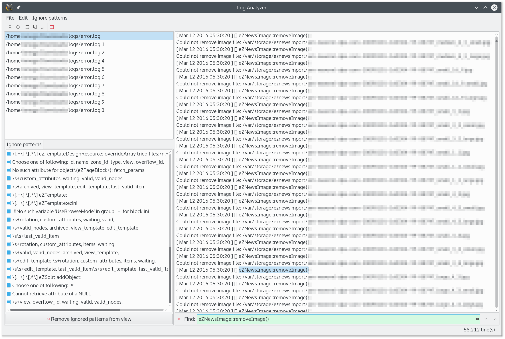

# LogAnalyzer 

[](https://travis-ci.org/pbek/loganalyzer)
[](https://ci.appveyor.com/project/pbek/loganalyzer)

**LogAnalyzer** is a tool that helps you analyzing your log files by reducing 
their content with patterns you define.  

## Screenshot


## Features

## Building LogAnalyzer
To get the most current features you can build the application from the 
source code. Download the latest source here: 
[LogAnalyzer Source on GitHub as ZIP](https://github.com/pbek/loganalyzer/archive/master.zip)

Alternatively you can also checkout the code directly from the git repository:

```shell
git clone https://github.com/pbek/loganalyzer.git -b master
cd loganalyzer
```

Then download [Qt Creator](http://www.qt.io/download-open-source), 
open the project file `src/LogAnalyzer.pro` and click on 
*Build / Build Project QOwnNotes*.

Or you can build it directly in your terminal:

```shell
cd src
qmake
make
```

## Minimum software requirements
- A desktop operating system, that supports [Qt](http://www.qt.io/)
- Qt 5.3+
- gcc 4.8+

## Disclaimer
This SOFTWARE PRODUCT is provided by THE PROVIDER "as is" and "with all faults." THE PROVIDER makes no representations or warranties of any kind concerning the safety, suitability, lack of viruses, inaccuracies, typographical errors, or other harmful components of this SOFTWARE PRODUCT. 

There are inherent dangers in the use of any software, and you are solely responsible for determining whether this SOFTWARE PRODUCT is compatible with your equipment and other software installed on your equipment. You are also solely responsible for the protection of your equipment and backup of your data, and THE PROVIDER will not be liable for any damages you may suffer in connection with using, modifying, or distributing this SOFTWARE PRODUCT.
